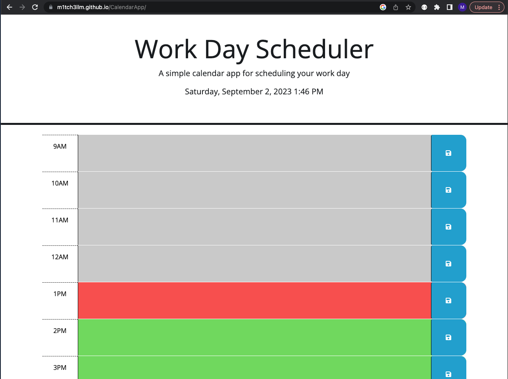

#Work Day Scheduler

#Description

The Work Day Scheduler is a web-based application designed to help you schedule and organize your workday. It provides a user-friendly interface to manage tasks and appointments for the day.

#Access

The Work Day Scheduler can be accessed as a website. Simply visit [Website URL] to start using the app.

#Technologies Used

The Work Day Scheduler is built using the following technologies:

HTML
CSS
JavaScript
jQuery
Day.js (for date and time handling)
System Requirements
There are no specific system requirements for using this app. It should work on modern web browsers.

#Features

Task Scheduling: Easily schedule tasks and appointments for your workday.
Time Highlighting: Past hours are displayed in gray, the current hour is highlighted in red, and future hours are highlighted in green.

#Link

[Link to Page](https://m1tch3llm.github.io/CalendarApp/)

#Photo

